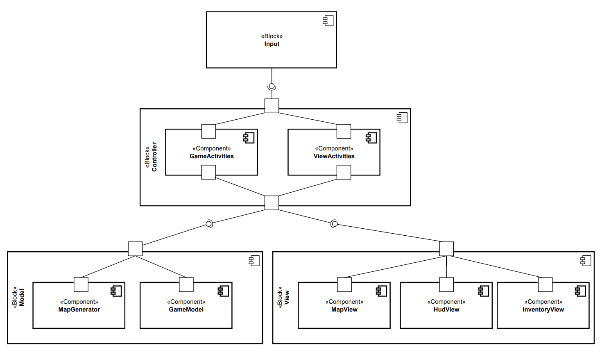

# Архитектура игры GTAVI

## Разработчики

* Илья Смирнов
* Владимир Федоров
* Никита Усольцев

## Запуск и тестирование

* **Build**
```
./gradlew gta-vi
```
* **Run**
```
java -jar build/libs/gta-vi.jar
```
* **Tests**
```
./gradlew test
```

## Управление

* Управление персонажем осуществляется с помощью клавиш со стрелками или клавиш ```W```, ```A```, ```S```, ```D```
* Выход из игры осуществляется с помощью ```ESC```
* Открытие и закрытие инвентаря просходит по кнопки  ```I```
* Eсли игрок находится на той же позиции, что и предмет(`$`), то по нажатию на ```SPACE``` происходит подбор предмета в инвентарь
* Кнопка ```ENTER``` выделяет текущий предмет в инвентаре
* Кнопка ```R``` удаляет предмет из инвентаря

## Игровой процесс
При запуске приложения перед игроком открывается главное меню, где ему предлагается выбрать, загружать ли карту с диска, либо сгенерировать новую случайным образом. Также на выбор дается тип врагов: 
* `DEFAULT`: обычные враги, которые имеют возможность ходить только на одну позицию.
* `FAST`: обычные враги, которые имеют возможность перепрыгивать через одну позицию. 
* `TANK`: враги будут иметь очень много здоровья
* `POWERFUL`: при атаке враг может забрать некое количество силы у игрока

Также при выборе любого типа на поле с некоторой вероятностью может появится "Ядовитая Плесень", которая может клонировать сама себя с небольшой вероятностью после каждого хода игрока. 

В самом начале игрок имеет некоторое количество силы и здоровья. Игрок расположен в случайной клетке, причем остальные клетки он не видит из-за "тумана войны". При переходе по дорогом новые клетки появляются. В каждой такой клетке могут располагаться различные предметы(`$`), а также враги с тремя различными стратегиями передвижения:
* пассивный враг, не двигается, атакует только при нападении
* трусливый враг, убегает в сторону, противоположную от игрока
* агрессивный враг, бежит в сторону игрока, чтобы немедленно атаковать

Чтобы нанести удар врагу, игроку достаточно перейти на ту же позицию, где находится враг. При этом игрок также получает некий урон от врага. Также игрок с некоторой вероятностью может дезоориентировать врага, из-за чего враг начнет двигаться в случайном направлении. С каждой победой над врагом игроку начисляются некоторые очки опыта(`exp`), благодаря которым игрок может повышать свой уровень и тем самым улучшать свои характеристики. 

## Общие сведения о системе

### Назначение

Игра в жанре [Roguelike](https://ru.wikipedia.org/wiki/Roguelike).

### Границы системы

- Однопользовательская оффлайн игра
- Отсутствует возможность сохранения прогресса
- Консольная графика

### Контекст системы

- Приложение запускается непосредственно на компьютере пользователя в терминале, никакие сетевые взаимодействия не
  предусмотрены
- Приложение нацелено на поддержку наиболее популярных среди целевой аудитории операционных систем

## Ключевые требования

### Технические ограничения

- У разработчиков отсутствуют машины под операционной системой Windows
- Выбранный язык программирования должен иметь библиотеку для отрисовки консольной графики

### Бизнес-ограничения

- Срок выполнения проекта - 2 месяца
- Игра распространяется бесплатно, наши вложения минимальны - пользуемся open-source фреймворками

### Качественные характеристики системы

- Расширяемая система с возможностью добавлять новые игровые сущности: персонажи, монстры, предметы, карты
- Сопровождаемость игры является ключевым фактором для дальнейшего развития игры, этому будет уделено существенное
  внимание
- Для системы сопровождаемость важнее производительности (однопользовательская пошаговая игра с простой графикой - мы рассчитываем, что пользователи этой игры будут сами дорабатывать игру)
- Гарантируется, что все файлы игры безопасны и личные данные пользователя никак не используются

### Ключевые функциональные требования

- Управление с помощью клавиатуры
- На поле расположены различные предметы, которые персонаж может подобрать и использовать(надеть/снять)
- Случайная генерация Grid-карты, есть возможность загрузки из файла
- При генерации карты в определенных местах создаются монстры и предметы с точностью до случайной окрестности
- Отображение здоровья, панели быстрого доступа к предметам
- Отдельное окно для характеристик персонажа(здоровье/сила атаки) и полного инвентаря по нажатию на заданную клавишу

## Роли и случаи использования

### Роли:

- Игрок
- Разработчик игры
- Дизайнер карты

### Случаи использования

- Игрок хочет отдохнуть/отвлечься и сыграть в нашу игру. Он не хочет, чтобы игра отбирала у него много нервов. Поэтому
  уровни должны быть сбалансированы под характеристики персонажа.
- Дизайнер карты хочет иметь возможность создавать свои карты или сохранять наиболее удачные случайно сгенерированные
  карты. Он не хочет взаимодействовать с кодом. Поэтому необходимо предоставить интерфейс для сохранения и загрузки карт
  при помощи специальных файлов.
- Разработчик игры хочет поддерживать игру, внедрять новую функциональность. Он не хочет как-то модифицировать уже
  написанный код, он хочет добавлять свой. Поэтому игра должна быть спроектирована таким образом, чтобы у любого
  программиста была возможность легко добавить новую желаемую функциональность.

### Типичный пользователь

<p align="center">
  
</p>

Джейсон - гений, миллиардер, плейбой, филантроп. Возраст: 54 года. Но мало кто знает, что он часто пользуется
терминалом. Он сильно устает от этого занятия и поэтому иногда ему необходимо отвлечься на 5-10 минут и повеселиться.
Правда работа не позволяет отвлекаться надолго, а компьютер не позволяет быстро запускать большие игры. Поэтому Джейсон
хочет в одну команду в терминале иметь возможность погружаться в совсем иной мир, где он будет сражаться с чудовищами и
носить тяжелую броню, а не писать bash скрипты.

## Композиция

<p align="center">
  
</p>

Используем слоистую архитектуру, основанную на шаблоне Model-View-Controller.

### Input

Слушает нажатия клавиш с клавиатуры и отправляет соответствующие события в блок ```Controller```

### GameActivities

Отвечает за распределение событий по блоку  ```Model```

### InventoryActivities

Отвечает за распределение событий по блоку  ```View```

### GameModel

Хранит состояние игрового сеанса

### MapGenerator

Генерирует случайную карту или загружает карту из файла

### MapView

Отображает игровую карту со всеми сущностями на ней

### InventoryView

Отображает инвентарь игрока, надетые предметы и характеристики персонажа

### HudView

Отображает игровой интерфейс: характеристики персонажа, количество жизней, панель быстрого доступа

## Логическая структура

<p align="center">
  
</p>

### Input 
* **GTAVI** запускает основной цикл программы, следит за нажатием кнопок с клавиатуры, отправляет события в *Controller*
* **Input** занимается считыванием внешних событий (нажатия кнопки на клавиатуре) 
* **EventType** содержит основные типы событий

### Сontroller
* **Controller** отправляет пришедшие события в **Activity**
* **GameActivity** занимается обработкой событий на стороне модели
* **ViewActivity** занимается обработкой событий на стороне view

### Model
* **GameState** меняет состояние модели: положение героя, обновление карты и т.д. 
* **Map** представляет собой список клеток(```Cell```), используется для сохранения конкретной карты. Строится при помощи `Map.Builder`
* **Cell** является частью карты. Хранит внутри свои координаты, а также имеет в себе информацию о содержании различных
  припасов и врагов
* **Passage** также является частью карты. Соединяет клетки между собой.
* **Movable**: базовый класс для сущностей, которые могут передвигаться по карте и атаковать друг друга
* **Hero**: класс главного героя, за которого будет играть пользователь. Наследуется от **Movable**
* **Enemy**: враг, с которым придется столкнуться главному герою на своем пути. Наследуется от **Movable**.
* **Item** предмет, который можно применить на героя
* **ConsumableItem** расходный предмет, восстанавливающий здоровье
* **EquipableItem** экипируемый предмет, может давать прирост к силе или здоровью. Можно одеть и снять предмет.
* **ItemType** тип предмета: 4 вида брони (могут быть экипированы одновременно) и 2 вида оружия (не могут быть
  экипированы одновременно)

### View
* **Drawable** интерфейс для класса, который может отобразиться на UI
* **MapView**, **InventoryView**, **InterfaceView** отображение карты, инвентаря и интерфейса на UI
* **Window** игровое окно для отображения всего состояния
* **Image** представление прямоугольной компоненты игрового окна

## Взаимодействия и состояния

### Диаграграмма конечных автоматов - диаграмма переходов между View

<p align="center">
  
</p>

При входе пользователь сразу видеть ```MapView```, если он нажмёт на один из элементов (характеристики героя, количество жизней, панель быстрого доступа), 
то фокус переключиться на ```InterfaceView```, обратный переход путём нажатия на любую точку карты. Так же из ```MapView``` мы можем попасть в ```InventoryView``` путём нажатия на соответсвующую кнопку.
Обратно вернуться можно будет с помощью кнопки Back. Выйти из игры можно с помочью кнопки Exit.

### Диаграграмма последовательностей - диаграмма нанесения урона нашему герою  

<p align="center">
  
</p>

У нас появляется ```GameActivity```, у которого вызывается метод ```handleEvent``` в который передается ```KeyEvent``` - событие что нашему герою нанесён удар от существа.
Потом нам нужно запросить состояние у модели: нам нужно понять какой ```strenght``` у enemy, потом вычесть это значение 
у нашего героя - из поля ```health```. Если всё прошло успешно: ```needRefreshUI``` выставляется в ```true```. Затем ```InventoryActivity```
вызывает у ```ViewBuilder``` метод ```setHero(Hero)``` чтобы обновить здоровье героя на UI.

